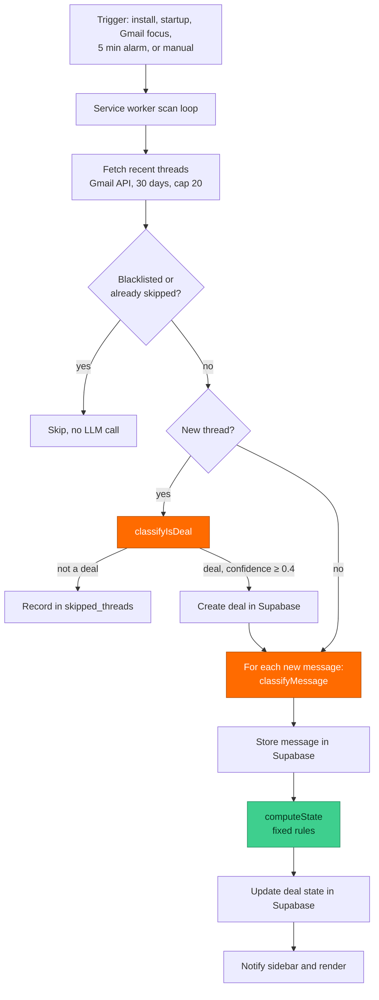

# Loop Back

Tracks which Gmail threads are waiting on you, and which have gone stale, from inside Gmail.


> 🏆 Winner · VillageHacks 2026 · Arizona State University


## What it is

Email threads that need follow up get buried. Loop Back scans your inbox, uses an LLM to decide which threads are worth tracking (deals, event coordination, action items), and renders a sidebar inside Gmail showing who owes the next reply and whether each thread is on schedule or stale. The LLM classifies individual messages; a deterministic state machine does everything else.

## What makes this interesting

- **Deterministic state, not LLM state.** The model only classifies individual message intent. A pure `computeState` function derives Direction and Timing from the message sequence using fixed rules (latest message direction, defer with a promised date, 14 day staleness, terminal reject or commit), so thread state stays auditable instead of depending on model output.
- **Cost discipline tuned to a real ceiling.** A sender blacklist runs before any LLM call and confirmed non deals are written to `skipped_threads`, so automated mail never costs a token twice. The classifier enforces a 1.5 second inter call gap, per scan caps of 20 threads and 50 calls, and a 180 second watchdog, and the periodic alarm only fires while a Gmail tab is visible. All of it is tuned to Groq's free tier (12k tokens per minute, 100k per day).
- **Surviving the MV3 context invalidation failure.** Reloading an extension while Gmail stays open kills `chrome.runtime` in still running content scripts. A bridge detects the dead runtime and shows a "refresh this tab" hint instead of throwing.
- **Dependency free and build free.** Vanilla JavaScript ES modules with no framework or bundler, talking to Supabase through a hand rolled PostgREST client over REST, so the MV3 service worker ships no runtime dependencies and needs no build step.

## Architecture



Orange steps are the only LLM calls. Every gate before them and the state decision after them are deterministic, which keeps token use down and thread state auditable.

Components:

- **Service worker** (`background/service-worker.js`): the scan loop, orchestration, debounce and timeout logic, alarm scheduling, and the message router.
- **Gmail API client** (`background/gmail-api.js`): OAuth token retrieval, thread and message fetch, header and body parsing, sender and direction detection.
- **LLM classifier** (`background/llm-classifier.js`): Groq chat completions in JSON mode, rate limiting, retries, and defensive JSON parsing.
- **State machine** (`background/state-machine.js`): a pure `computeState(messages)` returning direction, timing, terminal state, and staleness.
- **Supabase client** (`background/supabase-client.js`): a hand rolled PostgREST client for the three tables.
- **Content scripts and popup**: sidebar injection and rendering, the `chrome.runtime` bridge, and the settings and blacklist UI.

## Features

- **Automatic scanning, gated on visibility.** Triggered on install, browser startup, Gmail focus, a 5 minute alarm, and a manual button. Debounced to skip scans under 60 seconds apart and guarded by a 180 second watchdog.
- **Two stage LLM classification.** First decides whether a thread is trackable, then classifies each new message into one of 8 intents with a short summary, an optional promised date, and an optional dollar value.
- **Dual dimension state.** Every thread carries Direction (`you_owe` / `they_owe`) and Timing (`active` / `scheduled` / `stale`), plus terminal `won` / `dead`.
- **Sender blacklist and urgency.** Automated senders are skipped before any LLM call, and a thread is flagged urgent when it has waited on you for more than 3 days.

## Tech stack

- **Language**: vanilla JavaScript, ES modules. No framework, no bundler, no build step.
- **Platform**: Chrome Manifest V3. Module service worker, content scripts at `document_idle`.
- **LLM**: Groq, OpenAI compatible chat completions, model `llama-3.3-70b-versatile`.
- **Database**: Supabase (Postgres and PostgREST), accessed over REST with the anon key.
- **Auth**: Google OAuth2 via `chrome.identity`, scope `gmail.readonly`.

## Setup and run

<details>
<summary>Load the unpacked extension and connect Gmail (click to expand)</summary>

1. Clone the repo. At `chrome://extensions`, enable Developer mode and Load unpacked, pointed at the project directory.
2. Create a Supabase project and run the schema below.
3. Replace the placeholder OAuth `client_id` in `manifest.json` with your own Google Cloud OAuth client (Gmail read only scope).
4. Open the extension popup. Enter your Groq API key, Supabase URL, and Supabase anon key.
5. Click Connect Gmail and complete the Google OAuth consent.
6. Open Gmail. The sidebar injects and the first scan runs.

Schema:

```sql
create table deals (
  id uuid primary key default gen_random_uuid(),
  thread_id text unique not null,
  subject text,
  contact_name text,
  contact_email text,
  company text,
  deal_value numeric,
  current_state text check (current_state in
    ('waiting_on_you','waiting_on_them','scheduled','stale','dead','won')),
  staleness_days int,
  promised_date date,
  last_activity_at timestamptz,
  last_action_summary text,
  needs_response boolean,
  created_at timestamptz default now(),
  updated_at timestamptz default now()
);

create table messages (
  id uuid primary key default gen_random_uuid(),
  deal_id uuid references deals(id) on delete cascade,
  gmail_message_id text unique not null,
  direction text check (direction in ('inbound','outbound')),
  intent text check (intent in
    ('intro','ask','commit','defer','reject','agree','follow_up','info')),
  summary text,
  promised_date date,
  deal_value numeric,
  message_date timestamptz,
  created_at timestamptz default now()
);

create table skipped_threads (
  thread_id text primary key,
  checked_at timestamptz default now()
);

create index idx_deals_thread_id on deals(thread_id);
create index idx_deals_current_state on deals(current_state);
create index idx_messages_deal_id on messages(deal_id);
create index idx_messages_gmail_id on messages(gmail_message_id);

alter table deals enable row level security;
alter table messages enable row level security;
alter table skipped_threads enable row level security;
create policy "allow all" on deals for all using (true) with check (true);
create policy "allow all" on messages for all using (true) with check (true);
create policy "allow all" on skipped_threads for all using (true) with check (true);
```

</details>

## Roadmap

Loop Back runs today as a locally loaded extension for a single user. Where it goes next:

- **Per user security.** Replace the allow all RLS with per user policies, and move credentials behind a proxy instead of `chrome.storage.local`.
- **Multi account.** Add a user column so two Gmail accounts on one Supabase project keep separate deal pools.
- **First class state columns.** Persist Direction and Timing as their own columns rather than mapping to one legacy enum and rebuilding on read, removing the lossy combinations.
- **Resilience and observability.** A retry queue for failed classifications, and structured logs or metrics in place of console only logging.
- **On device classification.** An optional local model (for example via Ollama) so inbox content never leaves the machine.
